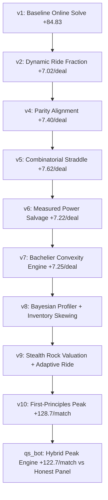

# Divided Oracle: Strategy & Mathematical Foundations

**Author:** Satvik Mittal (IIT Kanpur, Roll No: 240943)  
**Email:** [satvikmittal638@gmail.com](mailto:satvikmittal638@gmail.com)  
**Competition:** QuantStorm 2026 Round 1 — *Divided Oracle*

---

## 1. Executive Summary & Game Formulation

In the *Divided Oracle* market-making environment, two autonomous trading agents negotiate contracts on an underlying payoff variable $S$:

$$S = \sum_{i=1}^{40} C_i, \quad C_i \in \{-1, +1\} \text{ i.i.d. with } \mathbb{P}(C_i = +1) = 0.5$$

- **Hand Allocation**: 40 fair coins are drawn. 20 coins are dealt privately to Seat 0 and 20 to Seat 1.
- **Rounds**: A single deal spans 5 rounds ($r \in \{1, 2, 3, 4, 5\}$). In each round:
  1. **Reveal Phase**: 4 private coins are revealed to each respective player.
  2. **Auction Phase**: A blind first-price auction for 1 special game power using Tactical Energy (TE).
  3. **Negotiation Phase**: Up to 6 turns ($T_1 \dots T_6$) of two-way continuous quote-and-counter between Maker and Taker to establish a price $p$ for that round's contract.
- **Settlement**: All 5 round contracts settle simultaneously at the end of the deal against the true $S$:
  - Long position receives $S - p$.
  - Short position receives $p - S$.
  - Additional transfers: Maker obligation yield / miss penalty, forced-fill fees ($2.0$), SUBSTITUTE caps/refunds, and unspent TE salvage ($0.08 \times \Delta \text{TE}$).

---

## 2. Core Mathematical Edges

### Edge 1: Exact Parity-Lattice Straddle & Hypergeometric Quoting

Because $S$ is the sum of an even number ($N=40$) of $\pm 1$ coins, **$S$ is strictly even-parity**:

$$S \equiv 0 \pmod 2 \quad \implies \quad S \in \{-40, -38, \dots, -2, 0, 2, \dots, 38, 40\}$$

#### Maker Obligation Arbitrage
When quoting a two-way market with width $w = \text{ask} - \text{bid}$ and lower bound $\text{lo} = \text{bid}$:
1. **Straddle ($\text{lo} \le S \le \text{lo} + w$)**: Taker pays Maker $3.0 \times (1 - p_w)$.
2. **Miss ($S < \text{lo}$ or $S > \text{lo} + w$)**: Maker pays Taker $3.0 \times p_w$.
3. **Width Tax**: Maker pays Taker $0.22 \times (w - \text{floor})$.

The engine prices $p_w = \text{config.straddle\_prob}(r, w)$ using baseline unseen coins ($40 - 4r$) and canonical centering. A Maker possessing private information ($k_{\text{mine}} + \text{reads}$) computes the true probability of straddling $p_{\text{true}}$ using exact combinatorial binomial sums:

$$p_{\text{true}}(m, a, b) = \frac{1}{2^m} \sum_{\substack{j=a \\ (j-m) \equiv 0 \pmod 2}}^{b} \binom{m}{\frac{j+m}{2}}$$

where $m$ is the total unseen coins by both players, $a = \text{lo} - v$, and $b = \text{lo} - v + w$.

**Parity Alignment Edge**:
By forcing the quote lower bound $\text{lo}$ to align with the even parity of $S$, an even width $w=2$ covers two reachable points instead of one, extracting guaranteed excess yield from the obligation structure:

$$\mathbb{E}[\text{Obligation EV}] = 3.0 \times (p_{\text{true}} - p_{\text{priced}}) - 0.18 \times (w - \text{floor})$$

---

### Edge 2: Game-Theoretic Turn-6 Dominance & Forced-Fill Pricing

Negotiation strictly alternates across 6 turns:

$$\underbrace{T_1}_{\text{Maker quote}} \longrightarrow \underbrace{T_2}_{\text{Taker}} \longrightarrow \underbrace{T_3}_{\text{Maker}} \longrightarrow \underbrace{T_4}_{\text{Taker}} \longrightarrow \underbrace{T_5}_{\text{Maker}} \longrightarrow \underbrace{T_6}_{\text{Taker}}$$

**Taker Finality Property**: The Taker always holds the final action at $T_6$.
Under rule constraints:
- Counters must be clamped strictly within the existing quote.
- Minimum width is unbounded below (i.e., width 0 is legal: $\text{bid} = \text{ask}$).
- Unaccepted quotes at $T_6$ trigger a forced fill at the midpoint $\text{mid} = \lfloor \frac{\text{bid} + \text{ask}}{2} \rfloor + \text{shift}$, where the last quoter is designated short and incurs $\text{FORCED\_FILL\_FEE} = 2.0$.

#### The Taker's 3-Way Option Menu at Turn 6:
1. **Accept Buy**: Long @ $\text{ask} \implies \text{Payoff} = v - \text{ask}$
2. **Accept Sell**: Short @ $\text{bid} \implies \text{Payoff} = \text{bid} - v$
3. **Force Short via $(\text{ask}, \text{ask})$**: Short @ $\text{ask} + \text{shift} - 2.0 \implies \text{Payoff} = (\text{ask} + \text{shift}) - v - 2.0$

Option 3 strictly dominates Option 2 whenever the standing spread $w > 2$. The Taker's effective option payoff becomes:

$$\max\left(v - \text{ask}, \, \text{bid} - v, \, \text{ask} + \text{shift} - v - 2.0\right) \approx |\text{ask} - v| - 1.0$$

---

### Edge 3: Analytical Bachelier Option Model for SUBSTITUTE Convexity

The `SUBSTITUTE` power provides an asymmetric loss cushion: contract losses are capped at $-2.0$ ticks. 

Let the terminal PnL $X \sim \mathcal{N}(\mu, \sigma^2)$ where $\mu$ is the expected contract return and $\sigma = \sqrt{\text{unseen}}$.

#### Holding SUBSTITUTE
The payoff is $\max(X, -2.0)$. Evaluating the expectation under the Gaussian density:

$$\mathbb{E}[\max(X, -C)] = \mu \Phi(z) - C (1 - \Phi(z)) + \sigma \phi(z)$$

where $z = \frac{\mu + C}{\sigma}$, $\Phi(z) = \frac{1}{2}\left(1 + \text{erf}\left(\frac{z}{\sqrt{2}}\right)\right)$, and $\phi(z) = \frac{1}{\sqrt{2\pi}} e^{-\frac{z^2}{2}}$.

#### Counterparty Holding SUBSTITUTE
When the counterparty holds `SUBSTITUTE`, our payoff is bounded from above: $\min(X, +2.0) = -\max(-X, -2.0)$:

$$\mathbb{E}[\min(X, +C)] = -\mathbb{E}[\max(-X, -C)]$$

This closed-form analytic pricing replaces rough heuristic bounds with continuous probabilistic expectation across all negotiation turns.

---

### Edge 4: Real-Time Bayesian Belief Profiling & Physical Constraints

To infer the counterparty's private signal $k_{\text{theirs}}$ without falling victim to deceptive "liar" archetypes, the bot maintains a Bayesian state $(p_{\text{honest}}, p_{\text{passive}}, p_{\text{forcer}})$.

#### 1. Physical Coin Feasibility Constraints
In round $r$, the maximum possible absolute sum of revealed coins is $4r$:

$$|\text{mid}| \le 4r + 1.0 \implies \text{if violated: } p_{\text{honest}} \leftarrow p_{\text{honest}} \times 0.1$$

Between round $r_1$ and $r_2$, the maximum physical drift is $4|r_2 - r_1|$:

$$|\text{mid}_{r_2} - \text{mid}_{r_1}| \le 4|r_2 - r_1| + 1.0 \implies \text{if violated: } p_{\text{honest}} \leftarrow p_{\text{honest}} \times 0.1$$

#### 2. Ground-Truth FORESIGHT Cross-Validation
When our bot wins `FORESIGHT`, it observes a sample of the opponent's private coins $f_{\text{sum}}$. If the opponent's opening midpoint $\text{mid}$ deviates significantly from the true sample mean:

$$|\text{mid} - f_{\text{sum}}| > 2.5 \implies p_{\text{honest}} \leftarrow 0.0 \quad (\text{Immediate Liar Identification})$$

#### 3. Precision Signal Fusion
When multiple independent readings exist (FORESIGHT leak and historical honest quotes), signals are fused via inverse-variance weighting:

$$k_{\text{est}} = \frac{\sum_i \frac{e_i}{\sigma_i^2}}{\sum_i \frac{1}{\sigma_i^2}}, \quad \sigma_{\text{est}}^2 = \frac{1}{\sum_i \frac{1}{\sigma_i^2}}$$

---

### Edge 5: Adaptive Information-Driven Ride Hurdle

In turns 2 through 5, accepting early foregoes the optionality of turn 6. The bot enforces an adaptive acceptance hurdle:

$$\text{Hurdle} = \text{ride\_fraction} \times (\text{ask} - \text{bid})$$

| Information State | Belief Metric | Ride Fraction | Strategic Rationale |
|---|---|---|---|
| **Low Information** | $\text{info\_count} \le 2$ | `0.65` | High residual variance; preserve Turn 6 optionality |
| **Moderate Information** | $\text{info\_count} \in (2, 4]$ | `0.55` | Balanced monetization vs continuation value |
| **High Information** | $\text{info\_count} > 4$ | `0.50` | High confidence; capture immediate pricing edge |
| **Identified Liar** | $p_{\text{honest}} < 0.3$ | `0.85` | Refuse early settlement; force opponent into Turn 6 fee |
| **Aggressive Forcer** | $p_{\text{forcer}} > 0.5$ | $+0.10$ | Extra premium required to trade with shift campers |

---

### Edge 6: Decisive Power Valuation & Tactical Energy Salvage

Tactical Energy (TE) not spent in auctions earns guaranteed end-of-game salvage:

$$\text{Salvage Value} = 0.08 \times (\text{TE}_{\text{mine}} - \text{TE}_{\text{theirs}})$$

Bidding aggressively destroys the salvage baseline. Each power is valued analytically against its incremental PnL contribution:

- **FORESIGHT**: $V(r) = 0.75 \sqrt{\min(16, 4r)} + (0.5 \text{ if Maker})$
- **SUBSTITUTE**: $V(r) = 0.5 \times (r + 1.0)$
- **STEALTH_ROCK**: $V(r) = 2.0 \times 0.25 \times (5 - r + 1) = 0.5 \times (6 - r)$
- **TRICK_ROOM**: $V(r) = \frac{0.6}{r}$

**Dynamic Shading**:
$$\text{Bid} = \min\left(\text{budget}, \, \left\lfloor \frac{V(r)}{\text{TE\_SALVAGE}} \times \text{shade} \right\rfloor\right), \quad \text{where } \text{shade} = \begin{cases} 0.20 & \text{if passive} \\ 0.35 & \text{if forcer} \\ 0.33 & \text{default} \end{cases}$$

If the opponent's balance $\text{TE}_{\text{theirs}} \le 0$, we snipe all available powers for exactly $1\text{ TE}$.

---

## 3. Summary of Bot Version Progression

